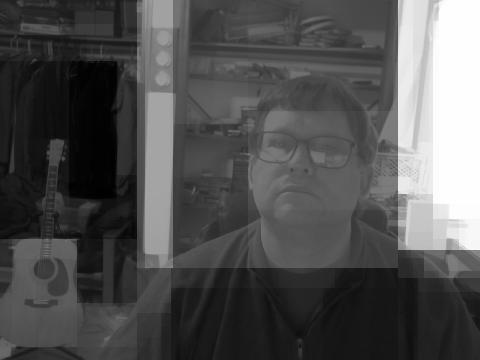

# geometrize: image contrast retiler toy
Bart Massey 2022

This little Rust toy takes an input image and "geometrizes"
it.  `geometrize` borrows the approach of this
[IOCCC Winner](https://www.ioccc.org/2020/kurdyukov2/index.html)
by Ilya Kurdyukov: such a nice graphic idea.

The program first converts the input image to grayscale. It
then

1. Splits the image either horizontally or vertically into
   two pieces, in a way that minimizes the pixel
   grayscale variance of each piece.

2. Recolors each piece to shrink pixel grayscale values toward
   the mean.

3. Recursively processes each piece, up to a maximum depth.

When the recursion is complete, a final rescaling of pixel
grayscale values is performed to make the image full-range.
Then the processed image is written out as a 16-bit
grayscale PNG.

Here is a picture of me:

Here is the geometrization of that picture:

Thanks to Ilya Kurdyukov for their inspiration.

This work is made available under the "Copyleft Next License
version 0.3.1".  Please see the file `LICENSE.txt` in this
distribution for license terms.
